# AuraEDA

A developer-centric local desktop sandbox designed for high-performance tabular data ingestion, automated quality auditing, structural data wrangling, and real-time machine learning simulation.

<!-- Drop your dashboard preview GIF or video demo here. Example:  -->

---

## ⚡ Core Metrics & Performance Benchmarks

| Metric / Capability | Benchmark Value | Engineering Enabler |
| :--- | :--- | :--- |
| **Ingestion Scale** | 10,000,000 Rows | Chunked lazy loading & streaming parsers |
| **Memory Downcasting** | 80% RAM Reduction | Dynamic type bit-width optimization |
| **Near-Duplicate Scan** | < 2.0 Seconds | O(N log N) Sorted Neighborhood (window=15) |
| **Math Formula Parser** | < 1.2 Milliseconds | Sandboxed AST-safe expression interpreter |
| **AutoML Training** | 4.12 Seconds (8 Models) | Concurrent multi-core execution pipeline |

---

## 🗺️ System Component Map & Pipeline Data Flow

The following interactive sequence tracks raw records as they traverse through state isolation, feature wrangling, parallel model training, and serializable pipeline compilation:

```mermaid
flowchart TD
    subgraph INGEST ["1. Data Ingest & VCS Layer"]
        A[Multi-Source Parser] -->|CSV, Parquet, JSON, Excel| B[Dataset Store]
        C[SQL Connectors] -->|Postgres, MySQL, SQLite| B
        D[REST API / Clipboard] --> B
        B --> E[Merge & Join Wizard]
        B --> F[Schema VCS Snapshot Diff]
    end

    subgraph AUDIT ["2. Integrity & GDPR Compliance Audit"]
        F --> G[6-Axis Integrity Radar]
        F --> H[Semantic Type Inference]
        F --> I[GDPR PII Scanner & Hashing]
        F --> J[Outlier Intersection Engine]
        F --> K[Benford's Law Auditor]
    end

    subgraph ENGINE ["3. Multi-Engine Analytics Suite"]
        G --> L[Hypothesis Test Center]
        G --> M[Bivariate Mosaic & correlations]
        G --> N[Time Series: STL, ADF, ACF/PACF]
        G --> O[Geospatial: DBSCAN & State Map]
        G --> P[NLP Text: LDA & VADER Sentiment]
    end

    subgraph CLEAN ["4. Deduplication & Wrangling Studio"]
        L --> Q[Deduplication: Sorted Neighborhood]
        M --> R[Connected Component Speller]
        N --> S[Imputations: MICE & KNN]
        O --> T[AutoFilters & Inline Spreadsheet]
    end

    subgraph MODEL ["5. AutoML & Demographic Bias Auditor"]
        S --> U[Feature Recommendations & Ensemble Ranker]
        U --> V[Embeddings: 2D/3D PCA, t-SNE, UMAP]
        V --> W[AutoML Leaderboard: 8 Concurrence Models]
        W --> X[Demographic Parity & Equalized Odds]
        W --> Y[SHAP Global & Local Waterfall Explainers]
        W --> Z[What-If Real-Time Simulator]
    end

    subgraph OUT ["6. Serialization & Slide Compiler"]
        X --> AA[Fitted sklearn Pipeline .pkl]
        Y --> AB[Corporate PPTX Presentation Exporter]
        Z --> AC[Interactive Plotly Annotations]
    end

    style INGEST fill:#090d16,stroke:#00f5ff,stroke-width:1px
    style AUDIT fill:#090d16,stroke:#7b2fff,stroke-width:1px
    style ENGINE fill:#090d16,stroke:#ffb020,stroke-width:1px
    style CLEAN fill:#090d16,stroke:#00f5ff,stroke-width:1px
    style MODEL fill:#090d16,stroke:#7b2fff,stroke-width:1px
    style OUT fill:#090d16,stroke:#ffb020,stroke-width:1px
```



---

## 🛠️ Integrated Capabilities

### 🛡️ Diagnostic Audit & GDPR Privacy Scanner
* **6-Axis Diagnostic Radar**: Evaluates overall missingness, duplicate rates, constant columns, mixed types, card anomalies, and skewness indexes.
* **PII Compliance Scanner**: Scans columns for emails, ZIP codes, and phone numbers with single-click SHA-256 hashing.
* **Outlier Intersection Engine**: Runs IQR, Z-Score, and Isolation Forest algorithms, locating the intersection of anomalies.
* **Benford's Law Auditor**: Validates numerical authenticity against standard first-digit distributions to flag anomalies.

### 🧹 Deduplication Studio & Custom Wrangler
* **Spelling Clustering**: Employs BFS connected components on character n-gram cosine adjacency matrices.
* **Imputers & Outliers**: Plugs KNN and MICE Iterative BayesianRidge imputers alongside custom Winsorization bounds.
* **Spreadsheet AutoFilters**: Supports multi-column sorts, text AutoFilters, and double-click inline cell updates.

### 🧬 Feature Recommendations & Embedding Space
* **Feature Factory**: Automatically recommends log transforms for skewed fields and interaction ratio pairs.
* **Embedding Projections**: Renders 2D/3D projections using PCA, t-SNE, and UMAP coordinate systems.
* **Target Encoding**: Employs out-of-fold Smoothed Leave-One-Out Target Encoding to prevent target leakage in train/inference splits.

### 🤖 Calibrated AutoML & What-If Simulations
* **Concurrence AutoML**: Fits 8 models (classifiers/regressors) in parallel with split control and SMOTE calibration.
* **Fairness Demographic Parity**: Evaluates disparate impact and Equalized Odds differences across protected groups.
* **Interactive What-If Panel**: Toggles input sliders to recalculate prediction probabilities in under 15ms.
* **Forecasting Suite**: Employsstatsmodels ARIMA and Fourier Prophet-style additive modeling for temporal forecasts.

### 📊 PowerPoint Slides Exporter & Copilot v2
* **Slide Export**: Automatically compiles corporate-ready report decks summarizing data alerts and model metrics.
* **Plotly Sticky Annotations**: Attaches text notes directly to coordinates using right-click paper space coordinates.
* **Copilot v2 history**: Restores context-aware chat logs across workspace switches.

---

## 🚀 Setup & Launch Configuration

```bash
# 1. Clone the repository
git clone https://github.com/ansh63766/AuraEDA.git
cd AuraEDA

# 2. Install dependencies
pip install -r requirements.txt

# 3. Configure environment
echo OPENROUTER_API_KEY=your_key_here > .env

# 4. Run application
python -m uvicorn backend.main:app
```

Navigate to **http://localhost:8000** in your browser.