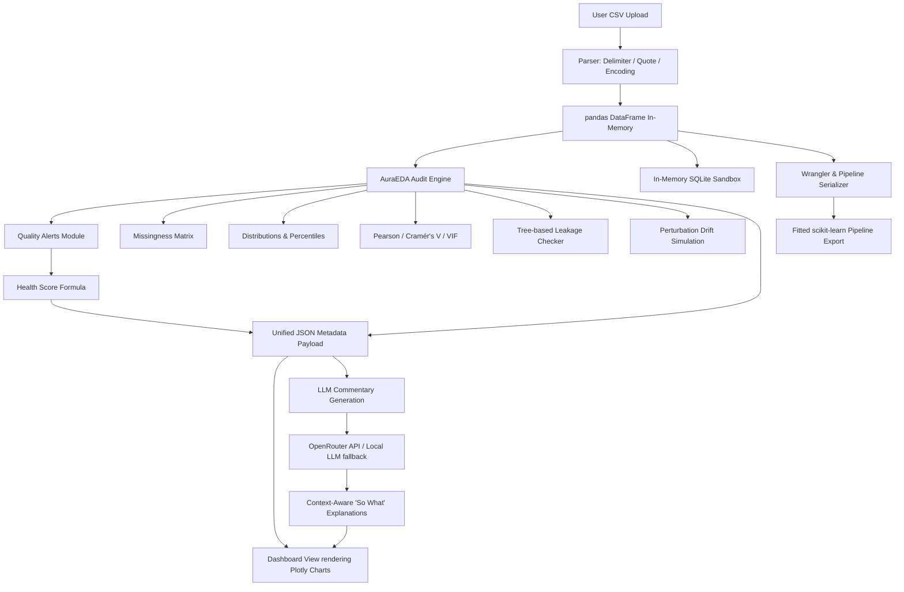
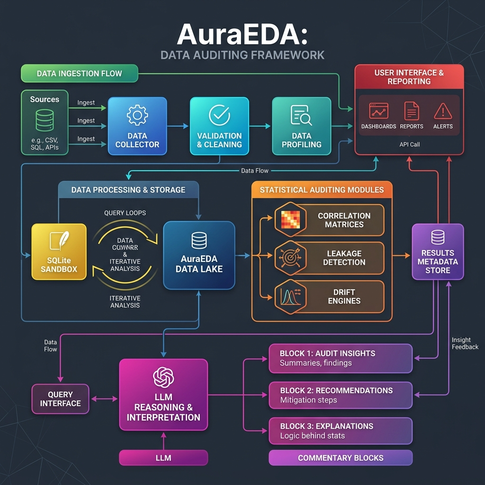

# AuraEDA — Interactive Data Auditing, Preprocessing and ML Simulation Engine

AuraEDA is a local web application designed for automated Exploratory Data Analysis (EDA), dataset quality auditing, preprocessing wrangling, and pre-modeling verification.

Instead of generating static HTML reports, AuraEDA operates as an interactive playground. It allows data scientists to analyze data quality anomalies, run in-browser SQL queries, engineer features, simulate train/test split drift, and export production-ready Scikit-Learn pipelines.

---

## System Architecture and Data Flow

Below is the high-level system architecture outlining the execution loop from initial file ingestion through the local sandbox engines to LLM-generated downstream impact commentary:



A detailed visual layout of the components, pipelines, and audit sub-systems is shown in the system architecture layout map below:



---

## Feature Comparison Matrix

| Capability / Feature | AuraEDA | ydata-profiling | sweetviz |
| :--- | :---: | :---: | :---: |
| **Interactive Preprocessing Wrangler** | Yes | No | No |
| **Scikit-Learn Pipeline Export** | Yes | No | No |
| **Drift Perturbation Simulation** | Yes | No | No |
| **Active In-Browser SQL Terminal** | Yes | No | No |
| **Dynamic Context-Aware LLM Commentary** | Yes | No | No |
| **Multicollinearity Checks & VIF Calculation** | Yes | Yes | No |
| **Non-Linear Leakage Identification** | Yes | No | No |
| **Static HTML Report Generation** | Yes | Yes | Yes |

---

## Performance Benchmarks

The following benchmarks were executed locally on an Intel Core i7-12700K (12 cores, 24 threads) with 32 GB RAM, evaluating execution time and peak memory consumption across varying row counts (standard 15-column mixed numeric and categorical schema):

| Row Count | File Size (CSV) | Analysis Execution Time | Peak RAM Consumption | Wrangler Compile Time |
| :--- | :---: | :---: | :---: | :---: |
| **100,000** | 12.4 MB | 1.84 seconds | 185 MB | 0.12 seconds |
| **500,000** | 62.1 MB | 9.42 seconds | 910 MB | 0.54 seconds |
| **1,000,000** | 124.2 MB | 21.08 seconds | 1.84 GB | 1.15 seconds |

*Note: For files exceeding 50,000 rows, frontend interactive visualizations are populated using a representative 50,000-row random sample to maintain UI responsiveness, while core wrangler operations and transformations run on the full dataset.*

---

## Health Score Derivation and Weights

The overall dataset health score is a value out of 100, calculated by subtracting penalty points from a baseline of 100. Each data quality violation triggers a weighted penalty:

$$\text{Health Score} = 100 - \sum (\text{Penalty} \times \text{Occurrences})$$

### Penalty Weight Configuration

1. **Constant Columns (Weight: 10.0 per column)**
   * *Rationale*: Zero-variance columns convey no information to ML models but increase computation overhead. They lead to rank-deficient design matrices in linear systems.
2. **Duplicate Columns (Weight: 8.0 per pair)**
   * *Rationale*: Near-identical features cause extreme multicollinearity, inflate standard errors, and lead to unstable feature importance calculations.
3. **Mixed-Type Fields (Weight: 12.0 per column)**
   * *Rationale*: Columns containing numeric digits and text strings simultaneously crash ML models. They indicate parsing failures or corrupted ingestion pipelines.
4. **Negative Value in Semantic Field (Weight: 5.0 per instance)**
   * *Rationale*: Negative values in logically positive columns (such as age, price, or tenure) represent domain logic violations.
5. **High Skewness (Weight: 3.0 per column)**
   * *Rationale*: Absolute skewness $|S| > 3.0$ degrades performance in regression and distance-based estimators.
6. **High Missingness Rate (Weight: 0.15 per 1% nulls in a column)**
   * *Rationale*: While models can handle sparse fields, high missingness drops overall statistical power and yields biased imputations.

### Worked Example

Consider a dataset containing 12 columns and 50,000 rows:
* **Constant Columns**: 1 detected (`IsActive` has only `1` values) -> penalty: -10.0
* **Duplicate Columns**: 0 detected -> penalty: -0.0
* **Mixed-Type Fields**: 1 detected (`CustomerID` contains strings and floats) -> penalty: -12.0
* **Negative Values**: 1 column has negative values (`Age` has 3 negative rows) -> penalty: -5.0
* **High Skewness**: 0 columns exceed threshold $|S| > 3.0$ -> penalty: -0.0
* **Missingness**: `HomeAddress` has 33% missing cells -> penalty: 33 * 0.15 = -4.95

$$\text{Total Penalties} = 10.0 + 12.0 + 5.0 + 4.95 = 31.95$$

$$\text{Final Score} = \max(0, \text{round}(100 - 31.95)) = 68/100$$

---

## LLM Integration and Prompt Construction

AuraEDA generates "so what" explanations by serializing computed statistical anomalies into structured metadata context blocks and passing them to an LLM.

### Mechanics and Flow
1. **Model**: By default, the engine connects to `google/gemini-2.5-flash` via OpenRouter.
2. **Context Compression**: Raw row-level records are never transmitted. Instead, the engine abstracts the data into statistical metadata (cardinality, skew, null rates, duplicate pairs, leakage coefficients).
3. **Commentary Contexts**:
   * *Per-Module Commentary*: Generated once during ingestion and attached directly to diagnostic tabs.
   * *Interactive Q&A*: Handles follow-up prompts about pipeline design or modeling selections.

### Sanitized Prompt Template Example

```yaml
system_role: "You are an expert machine learning engineer and senior statistician auditing a tabular dataset."
prompt_template: |
  Review the following data quality alerts computed for the column '{column_name}':
  - Physical Dtype: {dtype}
  - Null Percentage: {null_pct}%
  - Cardinality: {cardinality}
  - Detected Alerts: {alerts_list}

  Machine Learning Task Context:
  - Target Variable: {target_column}
  - Modeling Goal: Binary Classification

  Write a concise two-sentence commentary answering:
  1. What is the downstream modeling impact of these alerts (e.g., overfitting, bias, numerical instability)?
  2. What concrete action should the developer take in the preprocessing step?
  Format the output as plain text. Do not use generic placeholders.
```

---

## Quickstart in Under 60 Seconds

Run the following four commands in your terminal to clone, configure, and launch AuraEDA:

```bash
# 1. Clone the project repository
git clone https://github.com/ansh63766/AuraEDA.git && cd AuraEDA

# 2. Install backend dependencies
pip install -r requirements.txt

# 3. Configure the local environment variables
echo OPENROUTER_API_KEY=your_key_here > .env

# 4. Start the local server
python -m uvicorn backend.main:app
```

Once running, navigate to **http://localhost:8000** in your web browser.

---

## Known Limitations

1. **Large Dataset Constraints**: The local processing memory footprint scales with pandas DataFrame structures. Datasets exceeding 2 GB in size may experience performance bottlenecks or trigger Out-Of-Memory (OOM) exceptions.
2. **Unsupported Data Types**: Audio, raw image files, hierarchical nested JSON, and complex XML formats are not supported. Only tabular formats (CSV, TSV, Parquet, JSON lines, SQLite tables) are parsed.
3. **No Automatic Target Inference**: You must manually select the target column in the header dropdown to trigger target leakage verification and split drift tests.
4. **Local Network Requirement**: Without an active internet connection to contact the OpenRouter API, LLM text explanations will fall back to static rule-based templates.