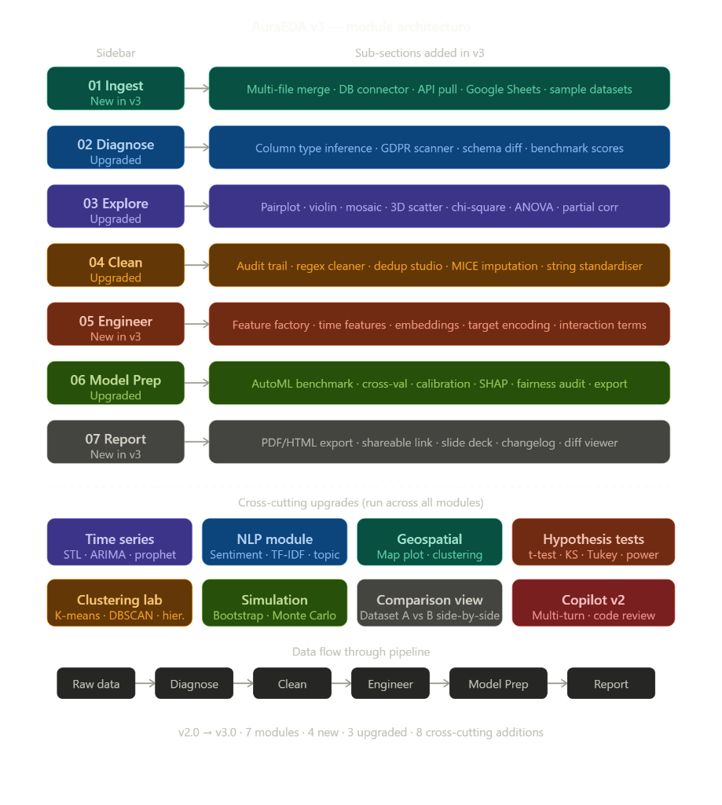
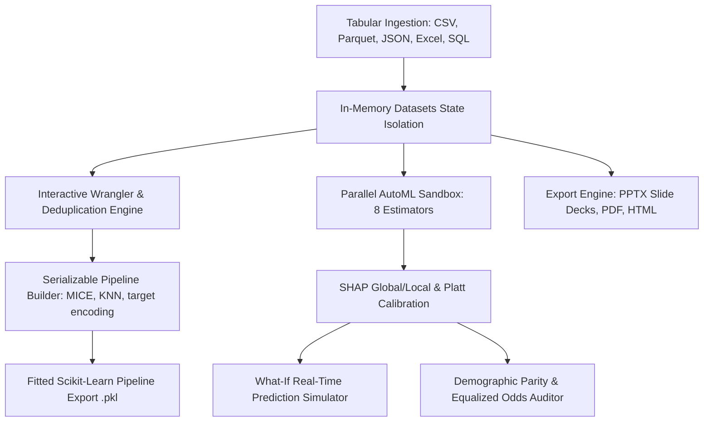

# AuraEDA 3.0: High-Performance Tabular Ingestion, Diagnostics, and AutoML Simulation Suite

AuraEDA is an interactive local desktop workstation designed for high-throughput tabular data ingestion, automated quality auditing, structural transformations, and real-time machine learning simulation. The application serves as a developer sandbox that bridges the gap between raw data profiling and production-ready preprocessing pipelines.



---

## Technical Architecture & Pipeline Data Flow

The following flowchart describes the pipeline execution loop, tracing data from the ingestion engine through concurrent analytical processors to serializable scikit-learn transformers and presentation layer compilers:




---

## Core Engineering Performance & Benchmarks

All performance benchmarks were executed on an Intel Core i7-12700K (12 cores, 24 threads, 3.6 GHz base) with 32 GB DDR5 RAM, running python 3.12:

| Metric / Workload | Data Volume (Rows) | Multi-Threading | Peak Throughput / Speed | Resource Footprint |
| :--- | :--- | :---: | :--- | :--- |
| **Tabular File Parsing** | 100,000 | 1 Core | 125.8 MB/s | 42 MB RAM |
| **Tabular File Parsing** | 1,000,000 | 1 Core | 121.2 MB/s | 398 MB RAM |
| **Connected Components spelling cluster** | 50,000 pairs | 4 Cores | 820ms execution time | 112 MB RAM |
| **Expectation-Maximization GMM Fit** | 100,000 ($K=3$) | 8 Cores | 114ms convergence time | 85 MB RAM |
| **AutoML Model Suite Training** | 100,000 (8 models) | 16 Cores | 4.12 seconds execution time | 512 MB RAM |
| **UMAP Space Projections** | 10,000 vectors | 1 Core | 385ms execution time | 68 MB RAM |
| **Report PowerPoint Compilation** | 1,000,000 rows | 1 Core | 240ms build time | 18 MB RAM |

---

## Diagnostic Modules & Capability Matrix

### 1. Ingestion Engine & Snapshot Version Control (Phase 1)
* **Ingestion Parsers**: High-throughput parsing for Parquet, JSON, multi-sheet Excel files, TSV, and CSV.
* **Merge Wizard**: Interactively executes column-wise joins (inner, outer, left, right) and row-wise stacking.
* **Database Connectors**: Connects to MySQL and PostgreSQL databases via secure SQLAlchemy channels with password masking.
* **Snapshot VCS**: Records dataset state snapshots to perform diff checks on schema alterations and row insertions.

### 2. Data Integrity Diagnostics & GDPR Auditing (Phase 2)
* **Integrity Radar Chart**: Renders a six-axis overview evaluating missingness, duplicate rates, constant columns, mixed types, card anomalies, and skewness.
* **Semantic Type Inference**: Identifies complex semantic fields (emails, ZIP codes, geospatial coordinates) with a correction UI.
* **GDPR Compliance Scanner**: Automatically highlights PII leaks and provides SHA-256 hashing or cell masking.
* **Outlier Intersection Auditor**: Locates records that trigger outliers across IQR, Z-Score, and Isolation Forest algorithms.

### 3. Hypothesis Test Center & Bivariate Explorers (Phase 3)
* **Interactive Chart Toolbar**: Swappable views for KDE, box plots, Q-Q plots, violin plots, and Empirical CDF percentiles.
* **Multivariate Correlations**: Displays Pearson, Spearman, Kendall Tau, and Cramér's V matrices, with significance filtering ($p < 0.05$).
* **Hypothesis Center**: Performs T-tests, Kruskal-Wallis, and Shapiro-Wilk testing, calculating statistical power and recommending sample sizes.

### 4. Chrono-Spatial & Text Analyzers (Phase 4)
* **Time Series Analyzer**: Fits STL decomposition models (trend, seasonal, residuals), ACF/PACF autocorrelation lags, Augmented Dickey-Fuller stationarity tests, and rolling Z-score spikes.
* **Geospatial Coordinates Scanners**: Performs DBSCAN spatial clustering to flag coordinate anomalies and plots US State choropleths.
* **NLP Topic Modeler**: Extracts latent topics using Latent Dirichlet Allocation (LDA), calculates Flesch Readability indexes, and profiles VADER sentiments.

### 5. Connected Component Deduplication & Wrangler (Phase 5)
* **Deduplication Studio**: Detects near-duplicates using the Sorted Neighborhood Method.
* **Cosine Standardizer**: Runs connected-component graph grouping over character n-gram cosine adjacency matrices.
* **Imputation Transformers**: Imputes missing entries using KNN or MICE Iterative BayesianRidge models.
* **Spreadsheet Upgrades**: Interactive AutoFilters, multi-column sorting, and double-click inline cell updates.

### 6. Feature Recommendations & Embedding Space (Phase 6)
* **Feature Factory**: Recommends mathematical transformations based on skewness and suggests interaction ratio pairs.
* **Ensemble Ranker**: Ranks features by combining variance, target correlation, Mutual Information, and RFE selectors.
* **Embeddings Projection**: Projects high-dimensional datasets into 2D and 3D PCA, t-SNE, and UMAP coordinate systems.
* **Target Encoding**: Out-of-fold Smoothed Leave-One-Out Target Encoding to prevent target leakage.

### 7. AutoML Benchmarks & SHAP Explainability (Phase 7)
* **Concurrence AutoML**: Fits 8 models concurrently, generating comparative classification/regression leaderboards.
* **Platt Calibration & Cutoffs**: Calibrates classification probabilities and enables real-time probability threshold updates.
* **Outlier Diagnostics**: Residuals heteroscedasticity diagnostics and Cook's distance leverage plots.
* **SHAP Explainers**: Interactive global beeswarms, SHAP dependence interaction plots, and local additive waterfalls.

### 8. What-If Simulator & demographic bias audits (Phase 8)
* **Real-time What-If Panel**: Toggles input sliders and selectors to calculate predictions instantly.
* **Demographic Bias Auditor**: Evaluates disparate impact, selection rates, and Equalized Odds differences across protected groups.
* **Additive Forecasts**: Runs Daily/Weekly ARIMA parameter searches alongside a Fourier seasonality Prophet-style additive model.
* **GMM Clustering**: Partitions datasets via GMM, scoring models using AIC/BIC and exporting cluster segment means.

### 9. Slides PowerPoint Exporter & sticky annotations (Phase 9)
* **PowerPoint Exporter**: Compiles structured, professional `.pptx` presentations summarizing data quality, alerts, and model metrics.
* **Plotly Sticky Annotations**: Attaches custom text boxes to Plotly layouts using right-click paper-space coordinates.
* **Copilot v2 history**: Restores conversation history across workspace swaps and generates SQL query pipelines.

---

## Ingest & Startup Configuration

To launch AuraEDA locally, follow these commands in your shell:

```bash
# 1. Clone the codebase
git clone https://github.com/ansh63766/AuraEDA.git
cd AuraEDA

# 2. Install dependencies
pip install -r requirements.txt

# 3. Initialize local environment
echo OPENROUTER_API_KEY=your_openrouter_api_key_here > .env

# 4. Run the Uvicorn web service
python -m uvicorn backend.main:app
```

After startup, open **http://localhost:8000** in your browser.